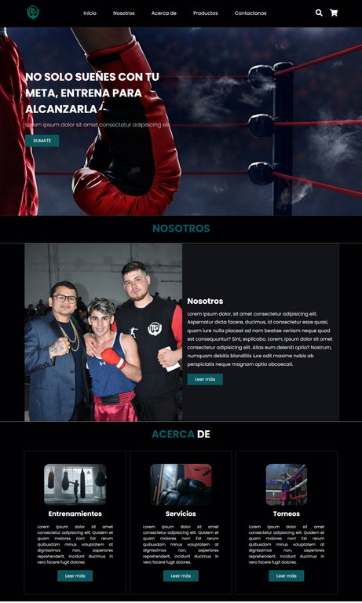
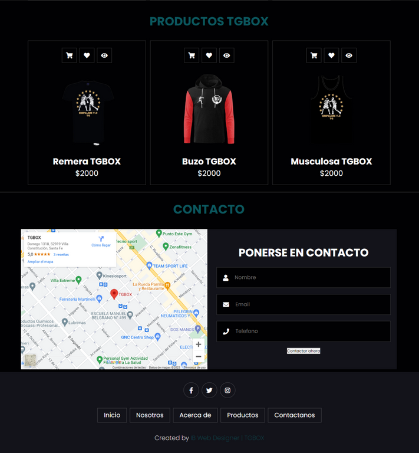

# proyecto-TGBOX

TGBox es un sitio web de boxeo diseñado y creado por Iara Barcos. Es una plataforma que proporciona información sobre las últimas novedades en el mundo del boxeo, fechas de torneos, una sección dedicada a la ropa de TGBox y un formulario de contacto para aquellos interesados en obtener más información.

El sitio web ha sido desarrollado utilizando HTML, CSS y JavaScript, y cuenta con un diseño responsive para asegurar una experiencia óptima tanto en computadoras de escritorio como en dispositivos móviles.

## Características
Página de inicio con las últimas novedades y eventos destacados.
Calendario de torneos con fechas, ubicaciones y detalles adicionales.
Sección dedicada a la ropa de TGBox, donde los usuarios pueden ver los productos disponibles.
Formulario de contacto para que los visitantes puedan enviar consultas y solicitar más información.

## Requisitos Previos
No se requieren requisitos previos especiales para ejecutar el sitio web. Solo necesitas un navegador web moderno y conexión a Internet.

## Instalación
Clona este repositorio: gh repo clone Iara2002/proyecto-TGBOX
Navega al directorio del proyecto

## Uso
1. Abre el archivo index.html en tu navegador preferido.
2. Explora las diferentes secciones del sitio web, incluyendo las novedades, fechas de torneos, ropa de TGBox y formulario de contacto.

## Contribución
¡Gracias por considerar contribuir al desarrollo del sitio web TGBox! Si deseas hacerlo, sigue estos pasos:

1. Crea un fork del proyecto.
2. Crea una nueva rama: git checkout -b mi-rama-de-funcionalidad
3. Realiza los cambios y commitea los archivos: git commit -m 'Agrega una nueva funcionalidad'
4. Envía los cambios a tu fork: git push origin mi-rama-de-funcionalidad
5. Crea una solicitud de extracción en GitHub.

## Autoría
Autor: Iara Barcos
GitHub: https://github.com/Iara2002

## Contacto
Si tienes alguna pregunta o sugerencia, no dudes en contactarme a través de iarabarcos19@hotmail.com
